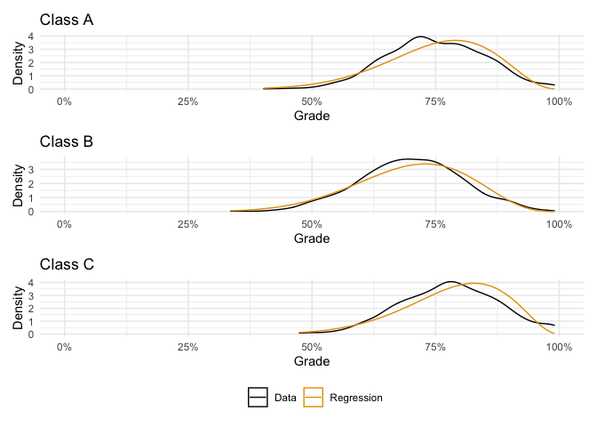

An Introduction to Beta Regression
================
Peter Rabinovitch
2022-04-17 14:13:10

``` r
library(tidyverse)
library(broom)
library(betareg)
library(ggridges)
library(patchwork)
```

# Introduction

Almost everyone knows how to do a linear regression, or even a multiple
regression, and many know things like logistic regression, but there are
many more types of regression that may be more suitable for your data.
One that I don’t think gets enough love is beta regression. Here I will
show you how to *use* it in R, and leave the theoretical derivations,
etc to the textbooks & papers.

I assume the reader is familiar with R, ggplot, and the lm function.

# The Beta Distribution

The beta distribution is nonzero on the interval \[0,1\] and so is
commonly used to represent a proportion, or a probability. It has two
parameters (referred to as shape1 and shape2 in R) that are both
positive real numbers.

## PDF

Here are some examples. Notably, when the two parameters are equal the
distribution is symmetric, and when they are both 1 the distribution is
uniform.

``` r
ggplot() +
  geom_function(fun = dbeta, args = list(shape1 = 6, shape2 = 4), aes(color = "shape1 = 6, shape2 = 4"), size = 1) +
  geom_function(fun = dbeta, args = list(shape1 = 60, shape2 = 40), aes(color = "shape1 = 60, shape2 = 40"), size = 1) +
  geom_function(fun = dbeta, args = list(shape1 = 9, shape2 = 1), aes(color = "shape1 = 9, shape2 = 1"), size = 1) +
  geom_function(fun = dbeta, args = list(shape1 = 2, shape2 = 11), aes(color = "shape1 = 2, shape2 = 11"), size = 1) +
  geom_function(fun = dbeta, args = list(shape1 = 1, shape2 = 1), aes(color = "shape1 = 1, shape2 = 1"), size = 1) +
  geom_function(fun = dbeta, args = list(shape1 = 1 / 2, shape2 = 1 / 2), aes(color = "shape1 = 1/2, shape2 = 1/2"), size = 1) +
  geom_function(fun = dbeta, args = list(shape1 = 1 / 4, shape2 = 2), aes(color = "shape1 = 1/4, shape2 = 2"), size = 1) +
  labs(
    title = "Beta Distributions",
    x = "x",
    y = "PDF"
  ) +
  ggthemes::scale_colour_colorblind(guide = guide_legend(nrow = 2)) +
  theme_minimal() +
  theme(legend.position = "bottom")
```

<!-- -->

## Parameters

The parameters shape1 and shape2 are frequently referred to as

and

in textbooks, as well as

and
.

The mean of a beta distribution with parameters

and

is
,
but the beta distribution is sometimes parametrized by

and another parameter
,
where
.

is called the *precision* parameter.

Translating between these is straightforward:


and

\times \phi")

The variance of a beta distribution is
}{1+\phi}")

If you work with beta distributions you will be doing this translation
frequently.

Finally, just in case you ever need it and do not have Wikipedia handy,
the mode of the beta distribution is


Translation code follows:

``` r
ab_2_muphi <- function(a, b) {
  list(
    mu = a / (a + b),
    phi = a + b
  )
}

muphi_2_ab <- function(mu, phi) {
  list(
    a = mu * phi,
    b = (1 - mu) * phi
  )
}
```

# Beta Regression

So, what if you have proportion data, and you want to model it with a
beta distribution?  
First check to see if it looks like it comes from a beta distribution.

We’ll generate some fake data for illustrative purposes. Imagine we have
students grades, scaled to 0-1, rather than 0-100%:

``` r
set.seed(2022)

n <- 1000
df <- tibble(grade = rnorm(n, 75, 10)) %>%
  mutate(
    grade = pmin(grade, 100),
    grade = pmax(0, grade),
    grade = grade / 100
  )
```

``` r
df %>%
  ggplot(aes(x = grade)) +
  geom_histogram(bins = 60) +
  theme_minimal() +
  scale_x_continuous(labels = scales::percent) +
  coord_cartesian(xlim = c(0, 1)) +
  labs(
    x = "Grade",
    y = "Count"
  ) +
  ggthemes::scale_colour_colorblind()
```

<!-- -->

Note there are some students who got 100% (i.e. 1). If we try to run a
beta regression on that we will get an error, as the values must be
greater than zero, and less than one. Here we will slightly modify the
data:

``` r
df <- df %>%
  mutate(
    grade = pmin(grade, 0.99),
    grade = pmax(0.01, grade)
  )
```

We could also use 1-epsilon, 0+epsilon, rather than 0.99 and 0.01, or we
could Google it and find other solutions (including things like
zoib’s!).

So the plot looks fairly beta-esque. Lets fit a beta distribution to it
and see:

``` r
params <- MASS::fitdistr(df$grade, "beta", list(shape1 = 0.75, shape2 = 0.5))
params
```

    ##      shape1       shape2  
    ##   11.3173445    3.7430689 
    ##  ( 0.5085245) ( 0.1607860)

``` r
df %>% 
  ggplot(aes(x = grade)) +
  geom_density(aes(color = "Data")) +
  geom_function(
    fun = dbeta, args = list(shape1 = params$estimate[1], shape2 = params$estimate[2]),
    aes(color = "Fitted Beta Distribution")
  ) +
  theme_minimal() +
  scale_x_continuous(labels = scales::percent) +
  coord_cartesian(xlim = c(0, 1)) +
  labs(
    x = "Grade",
    y = "Density",
    colour = NULL
  ) +
  ggthemes::scale_colour_colorblind()
```

<!-- -->

We see that although there are differences, the beta is pretty close.

## Example 1

Now lets try to fit the data with a beta regression - this is the
simplest possible case.

``` r
mod <- betareg(grade ~ 1, data = df)
summary(mod)
```

    ## 
    ## Call:
    ## betareg(formula = grade ~ 1, data = df)
    ## 
    ## Standardized weighted residuals 2:
    ##     Min      1Q  Median      3Q     Max 
    ## -2.5303 -0.6903 -0.2040  0.4829  5.3802 
    ## 
    ## Coefficients (mean model with logit link):
    ##             Estimate Std. Error z value Pr(>|z|)    
    ## (Intercept)  1.10643    0.01823   60.68   <2e-16 ***
    ## 
    ## Phi coefficients (precision model with identity link):
    ##       Estimate Std. Error z value Pr(>|z|)    
    ## (phi)  15.0604     0.6588   22.86   <2e-16 ***
    ## ---
    ## Signif. codes:  0 '***' 0.001 '**' 0.01 '*' 0.05 '.' 0.1 ' ' 1 
    ## 
    ## Type of estimator: ML (maximum likelihood)
    ## Log-likelihood: 845.3 on 2 Df
    ## Number of iterations: 9 (BFGS) + 2 (Fisher scoring)

Notice the ‘logit link’ for the intercept, and the ‘identity link’ for
the precision (phi). When doing beta regression you need to pay
attention to these (they change depending on exactly what you are
modeling), and how you handle the coefficients depends on the link.

To compare to the coefficients above, we have some transformations to
do. Because betareg gives the mean estimate on a logit scale, we have to
use plogis to get back the linear scale:

``` r
mu <- plogis(mod$coefficients$mean)
mu
```

    ## (Intercept) 
    ##    0.751463

``` r
phi <- mod$coefficients$precision
phi
```

    ##   (phi) 
    ## 15.0604

``` r
ab <- muphi_2_ab(mu, phi)
ab
```

    ## $a
    ## (Intercept) 
    ##    11.31733 
    ## 
    ## $b
    ## (Intercept) 
    ##    3.743066

These are very close to what was reported above, but let’s plot just to
see:

``` r
df %>% 
  ggplot(aes(x = grade)) +
  geom_density(aes(color = "Data")) +
  geom_function(
    fun = dbeta, args = list(shape1 = params$estimate[1], shape2 = params$estimate[2]),
    aes(color = "Fitted Beta Distribution")
  ) +
  geom_function(
    fun = dbeta, args = list(shape1 = ab$a, shape2 = ab$b),
    aes(color = "Beta Regression")
  ) +
  theme_minimal() +
  scale_x_continuous(labels = scales::percent) +
  coord_cartesian(xlim = c(0, 1)) +
  labs(
    x = "Grade",
    y = "Density",
    colour = NULL
  ) +
  ggthemes::scale_colour_colorblind()
```

<!-- -->

The regression and fitted lines overlap - we can’t see any difference.

Note more quirks (about scaling of parameters with plogis, etc) of
betareg are coming up.

## Example 2

Example 2 is similar to the above, but now with three different classes.

``` r
set.seed(2022)

n <- 1000
df <- bind_rows(
  tibble(grade = rnorm(n, 75, 10), class = "A"),
  tibble(grade = rnorm(n, 70, 10), class = "B"),
  tibble(grade = rnorm(n, 78, 10), class = "C")
) %>%
  mutate(
    grade = pmin(grade, 99),
    grade = pmax(1, grade),
    grade = grade / 100
  )
```

``` r
df %>% 
  ggplot(aes(x = grade, y = class)) +
  geom_density_ridges() +
  theme_minimal() +
  scale_x_continuous(labels = scales::percent) +
  coord_cartesian(xlim = c(0, 1)) +
  labs(
    x = "Grade",
    y = "Class",
    title = "PDF"
  ) +
  ggthemes::scale_colour_colorblind()
```

<!-- -->

Note that the classes have different means, but the same variance.

We do a beta regression with the class as the independent variable:

``` r
mod <- betareg(grade ~ class, data = df)
summary(mod)
```

    ## 
    ## Call:
    ## betareg(formula = grade ~ class, data = df)
    ## 
    ## Standardized weighted residuals 2:
    ##     Min      1Q  Median      3Q     Max 
    ## -2.6910 -0.6908 -0.1699  0.4973  6.2497 
    ## 
    ## Coefficients (mean model with logit link):
    ##             Estimate Std. Error z value Pr(>|z|)    
    ## (Intercept)  1.10575    0.01801  61.386  < 2e-16 ***
    ## classB      -0.26605    0.02468 -10.780  < 2e-16 ***
    ## classC       0.18345    0.02579   7.113 1.14e-12 ***
    ## 
    ## Phi coefficients (precision model with identity link):
    ##       Estimate Std. Error z value Pr(>|z|)    
    ## (phi)  14.9462     0.3774    39.6   <2e-16 ***
    ## ---
    ## Signif. codes:  0 '***' 0.001 '**' 0.01 '*' 0.05 '.' 0.1 ' ' 1 
    ## 
    ## Type of estimator: ML (maximum likelihood)
    ## Log-likelihood:  2514 on 4 Df
    ## Pseudo R-squared: 0.0826
    ## Number of iterations: 13 (BFGS) + 2 (Fisher scoring)

Here we have three parameters for the mean: the intercept and the
estimates for being in class B and class C; as well as one parameter for
the precision.

Let us first consider class A:

``` r
mu <- plogis(mod$coefficients$mean[1])
mu
```

    ## (Intercept) 
    ##   0.7513359

``` r
phi <- mod$coefficients$precision
phi
```

    ##    (phi) 
    ## 14.94619

``` r
ab_A <- muphi_2_ab(mu, phi)
ab_A
```

    ## $a
    ## (Intercept) 
    ##    11.22961 
    ## 
    ## $b
    ## (Intercept) 
    ##    3.716581

and now class B

``` r
mu <- plogis(mod$coefficients$mean[1] + mod$coefficients$mean[2])
mu
```

    ## (Intercept) 
    ##   0.6984017

``` r
phi <- mod$coefficients$precision
phi
```

    ##    (phi) 
    ## 14.94619

``` r
ab_B <- muphi_2_ab(mu, phi)
ab_B
```

    ## $a
    ## (Intercept) 
    ##    10.43844 
    ## 
    ## $b
    ## (Intercept) 
    ##    4.507747

and finally class C

``` r
mu <- plogis(mod$coefficients$mean[1] + mod$coefficients$mean[3])
mu
```

    ## (Intercept) 
    ##   0.7840113

``` r
phi <- mod$coefficients$precision
phi
```

    ##    (phi) 
    ## 14.94619

``` r
ab_C <- muphi_2_ab(mu, phi)
ab_C
```

    ## $a
    ## (Intercept) 
    ##    11.71798 
    ## 
    ## $b
    ## (Intercept) 
    ##    3.228209

Notice how close the regression estimates of the mean (0.752,
0.699,0.785) are to the (known) values of 75,70 & 78%.

We next plot the density of each class, along with the beta distribution
for each as estimated by the beta regression.

``` r
p1 <- df %>%
  filter(class == "A") %>%
  ggplot(aes(x = grade, colour = "Data")) +
  geom_density() +
  geom_function(fun = dbeta, args = list(shape1 = ab_A$a, shape2 = ab_A$b), aes(color = "Regression")) +
  theme_minimal() +
  scale_x_continuous(labels = scales::percent) +
  coord_cartesian(xlim = c(0, 1)) +
  labs(
    x = "Grade",
    y = "Density",
    colour = NULL,
    title = "Class A"
  ) +
  ggthemes::scale_colour_colorblind()

p2 <- df %>%
  filter(class == "B") %>%
  ggplot(aes(x = grade, colour = "Data")) +
  geom_density() +
  geom_function(fun = dbeta, args = list(shape1 = ab_B$a, shape2 = ab_B$b), aes(color = "Regression")) +
  theme_minimal() +
  scale_x_continuous(labels = scales::percent) +
  coord_cartesian(xlim = c(0, 1)) +
  labs(
    x = "Grade",
    y = "Density",
    colour = NULL,
    title = "Class B"
  ) +
  ggthemes::scale_colour_colorblind()

p3 <- df %>%
  filter(class == "C") %>%
  ggplot(aes(x = grade, colour = "Data")) +
  geom_density() +
  geom_function(fun = dbeta, args = list(shape1 = ab_C$a, shape2 = ab_C$b), aes(color = "Regression")) +
  theme_minimal() +
  scale_x_continuous(labels = scales::percent) +
  coord_cartesian(xlim = c(0, 1)) +
  labs(
    x = "Grade",
    y = "Density",
    colour = NULL,
    title = "Class C"
  ) +
  ggthemes::scale_colour_colorblind()

p1 / p2 / p3 + plot_layout(guides = "collect") & theme(legend.position = "bottom")
```

<!-- -->

## Example 3

In example 2 each class had the same variance. Here we will change that
and model the grades 1) as though there was a common precision, and 2)
as though they have differing precisions.

Here is the data:

``` r
set.seed(2022)

n <- 1000
df <- bind_rows(
  tibble(grade = rnorm(n, 75, 2), class = "A"),
  tibble(grade = rnorm(n, 70, 10), class = "B"),
  tibble(grade = rnorm(n, 78, 5), class = "C"),
) %>%
  mutate(
    grade = pmin(grade, 99), # needed for beta regression
    grade = pmax(1, grade),
    grade = grade / 100
  )

df %>% 
  ggplot(aes(x = grade, y = class)) +
  geom_density_ridges(stat = "binline", bins = 20, scale = 0.95, draw_baseline = FALSE) +
  theme_minimal() +
  scale_x_continuous(labels = scales::percent) +
  coord_cartesian(xlim = c(0, 1)) +
  labs(
    x = "Grade",
    y = "Density",
    colour = NULL
  ) +
  ggthemes::scale_colour_colorblind()
```

<!-- -->

### Same precision

Here we assume in the model that each class has the same phi, i.e. the
different classes do not have different variances.

Note the syntax is just like you are used to from lm, glm, etc.

``` r
mod <- betareg(grade ~ class, data = df)
summary(mod)
```

    ## 
    ## Call:
    ## betareg(formula = grade ~ class, data = df)
    ## 
    ## Standardized weighted residuals 2:
    ##     Min      1Q  Median      3Q     Max 
    ## -4.4939 -0.4640 -0.0524  0.3737 10.4369 
    ## 
    ## Coefficients (mean model with logit link):
    ##             Estimate Std. Error z value Pr(>|z|)    
    ## (Intercept)  1.06882    0.01126   94.92   <2e-16 ***
    ## classB      -0.18826    0.01558  -12.09   <2e-16 ***
    ## classC       0.18036    0.01624   11.10   <2e-16 ***
    ## 
    ## Phi coefficients (precision model with identity link):
    ##       Estimate Std. Error z value Pr(>|z|)    
    ## (phi)   39.994      1.023   39.09   <2e-16 ***
    ## ---
    ## Signif. codes:  0 '***' 0.001 '**' 0.01 '*' 0.05 '.' 0.1 ' ' 1 
    ## 
    ## Type of estimator: ML (maximum likelihood)
    ## Log-likelihood:  3842 on 4 Df
    ## Pseudo R-squared: 0.1507
    ## Number of iterations: 8 (BFGS) + 2 (Fisher scoring)

Let us first consider class A:

``` r
mu <- plogis(mod$coefficients$mean[1])
mu
```

    ## (Intercept) 
    ##   0.7443727

``` r
phi <- mod$coefficients$precision
phi
```

    ##    (phi) 
    ## 39.99417

``` r
ab_A <- muphi_2_ab(mu, phi)
ab_A
```

    ## $a
    ## (Intercept) 
    ##    29.77057 
    ## 
    ## $b
    ## (Intercept) 
    ##     10.2236

and now class B

``` r
mu <- plogis(mod$coefficients$mean[1] + mod$coefficients$mean[2])
mu
```

    ## (Intercept) 
    ##    0.706938

``` r
phi <- mod$coefficients$precision
phi
```

    ##    (phi) 
    ## 39.99417

``` r
ab_B <- muphi_2_ab(mu, phi)
ab_B
```

    ## $a
    ## (Intercept) 
    ##     28.2734 
    ## 
    ## $b
    ## (Intercept) 
    ##    11.72077

and finally class C

``` r
mu <- plogis(mod$coefficients$mean[1] + mod$coefficients$mean[3])
mu
```

    ## (Intercept) 
    ##    0.777158

``` r
phi <- mod$coefficients$precision
phi
```

    ##    (phi) 
    ## 39.99417

``` r
ab_C <- muphi_2_ab(mu, phi)
ab_C
```

    ## $a
    ## (Intercept) 
    ##    31.08179 
    ## 
    ## $b
    ## (Intercept) 
    ##    8.912381

``` r
p1 <- df %>%
  filter(class == "A") %>%
  ggplot(aes(x = grade, colour = "Data")) +
  geom_density() +
  geom_function(fun = dbeta, args = list(shape1 = ab_A$a, shape2 = ab_A$b), aes(color = "Regression")) +
  theme_minimal() +
  scale_x_continuous(labels = scales::percent) +
  coord_cartesian(xlim = c(0, 1)) +
  labs(
    x = "Grade",
    y = "Density",
    colour = NULL,
    title = "Class A"
  ) +
  ggthemes::scale_colour_colorblind()

p2 <- df %>%
  filter(class == "B") %>%
  ggplot(aes(x = grade, colour = "Data")) +
  geom_density() +
  geom_function(fun = dbeta, args = list(shape1 = ab_B$a, shape2 = ab_B$b), aes(color = "Regression")) +
  theme_minimal() +
  scale_x_continuous(labels = scales::percent) +
  coord_cartesian(xlim = c(0, 1)) +
  labs(
    x = "Grade",
    y = "Density",
    colour = NULL,
    title = "Class B"
  ) +
  ggthemes::scale_colour_colorblind()

p3 <- df %>%
  filter(class == "C") %>%
  ggplot(aes(x = grade, colour = "Data")) +
  geom_density() +
  geom_function(fun = dbeta, args = list(shape1 = ab_C$a, shape2 = ab_C$b), aes(color = "Regression")) +
  theme_minimal() +
  scale_x_continuous(labels = scales::percent) +
  coord_cartesian(xlim = c(0, 1)) +
  labs(
    x = "Grade",
    y = "Density",
    colour = NULL,
    title = "Class C"
  ) +
  ggthemes::scale_colour_colorblind()

p1 / p2 / p3 + plot_layout(guides = "collect") & theme(legend.position = "bottom")
```

<!-- -->

The fit here is not quite as good, most likely because the different
classes have different precisions, but our regression is assuming they
share one precision.

### Different precision

Here is an area where betareg shines - not only can we model the mean,
but the precision. The syntax looks like what you may be familiar with
from lme4, but its meaning is different. The part after the bar ‘\|’ is
the part that models the precision.

``` r
mod <- betareg(grade ~ class | class, data = df)
summary(mod)
```

    ## 
    ## Call:
    ## betareg(formula = grade ~ class | class, data = df)
    ## 
    ## Standardized weighted residuals 2:
    ##     Min      1Q  Median      3Q     Max 
    ## -3.2286 -0.6869 -0.0927  0.6134  6.8313 
    ## 
    ## Coefficients (mean model with logit link):
    ##              Estimate Std. Error z value Pr(>|z|)    
    ## (Intercept)  1.098773   0.003377  325.38   <2e-16 ***
    ## classB      -0.249208   0.016312  -15.28   <2e-16 ***
    ## classC       0.165602   0.010039   16.50   <2e-16 ***
    ## 
    ## Phi coefficients (precision model with log link):
    ##             Estimate Std. Error z value Pr(>|z|)    
    ## (Intercept)  6.14573    0.04468  137.54   <2e-16 ***
    ## classB      -3.27344    0.06251  -52.37   <2e-16 ***
    ## classC      -1.98456    0.06306  -31.47   <2e-16 ***
    ## ---
    ## Signif. codes:  0 '***' 0.001 '**' 0.01 '*' 0.05 '.' 0.1 ' ' 1 
    ## 
    ## Type of estimator: ML (maximum likelihood)
    ## Log-likelihood:  4897 on 6 Df
    ## Pseudo R-squared: 0.149
    ## Number of iterations: 26 (BFGS) + 2 (Fisher scoring)

Let us first consider class A:

``` r
mu <- plogis(mod$coefficients$mean[1])
mu
```

    ## (Intercept) 
    ##   0.7500301

``` r
phi <- exp(mod$coefficients$precision[1]) # note exp because log link for precision
phi
```

    ## (Intercept) 
    ##    466.7188

``` r
ab_A <- muphi_2_ab(mu, phi)
ab_A
```

    ## $a
    ## (Intercept) 
    ##    350.0532 
    ## 
    ## $b
    ## (Intercept) 
    ##    116.6657

and now class B

``` r
mu <- plogis(mod$coefficients$mean[1]+mod$coefficients$mean[2])
mu
```

    ## (Intercept) 
    ##   0.7004757

``` r
phi <- exp(mod$coefficients$precision[1]+mod$coefficients$precision[2]) 
phi
```

    ## (Intercept) 
    ##    17.67745

``` r
ab_B <- muphi_2_ab(mu, phi)
ab_B
```

    ## $a
    ## (Intercept) 
    ##    12.38262 
    ## 
    ## $b
    ## (Intercept) 
    ##    5.294824

and finally class C

``` r
mu <- plogis(mod$coefficients$mean[1]+mod$coefficients$mean[3])
mu
```

    ## (Intercept) 
    ##   0.7797783

``` r
phi <- exp(mod$coefficients$precision[1]+mod$coefficients$precision[3]) 
phi
```

    ## (Intercept) 
    ##    64.14605

``` r
ab_C <- muphi_2_ab(mu, phi)
ab_C
```

    ## $a
    ## (Intercept) 
    ##    50.01969 
    ## 
    ## $b
    ## (Intercept) 
    ##    14.12635

``` r
p1 <- df %>%
  filter(class == "A") %>%
  ggplot(aes(x = grade, colour = "Data")) +
  geom_density() +
  geom_function(fun = dbeta, args = list(shape1 = ab_A$a, shape2 = ab_A$b), aes(color = "Regression")) +
  theme_minimal() +
  scale_x_continuous(labels = scales::percent) +
  coord_cartesian(xlim = c(0, 1)) +
  labs(
    x = "Grade",
    y = "Density",
    colour = NULL,
    title = "Class A"
  ) +
  ggthemes::scale_colour_colorblind()

p2 <- df %>%
  filter(class == "B") %>%
  ggplot(aes(x = grade, colour = "Data")) +
  geom_density() +
  geom_function(fun = dbeta, args = list(shape1 = ab_B$a, shape2 = ab_B$b), aes(color = "Regression")) +
  theme_minimal() +
  scale_x_continuous(labels = scales::percent) +
  coord_cartesian(xlim = c(0, 1)) +
  labs(
    x = "Grade",
    y = "Density",
    colour = NULL,
    title = "Class B"
  ) +
  ggthemes::scale_colour_colorblind()

p3 <- df %>%
  filter(class == "C") %>%
  ggplot(aes(x = grade, colour = "Data")) +
  geom_density() +
  geom_function(fun = dbeta, args = list(shape1 = ab_C$a, shape2 = ab_C$b), aes(color = "Regression")) +
  theme_minimal() +
  scale_x_continuous(labels = scales::percent) +
  coord_cartesian(xlim = c(0, 1)) +
  labs(
    x = "Grade",
    y = "Density",
    colour = NULL,
    title = "Class C"
  ) +
  ggthemes::scale_colour_colorblind()


p1 / p2 / p3 + plot_layout(guides = "collect") & theme(legend.position = "bottom")
```

<!-- -->

Pretty cool, eh?

## Example 4

Here we will ad a numerical covariate, *hours studied* for the final
exam, say between 0 and 10 hours. And we will have the effect of the
hours studied vary by class.

``` r
set.seed(2022)

n <- 1000
df <- bind_rows(
  tibble(hrs = runif(n, 0, 10), grade = rnorm(n, 50 + hrs * 5, 2), class = "A"),
  tibble(hrs = runif(n, 0, 10), grade = rnorm(n, 40 + hrs * 6, 10), class = "B"),
  tibble(hrs = runif(n, 0, 10), grade = rnorm(n, 38 + hrs * 8, 5), class = "C"),
) %>%
  mutate(
    grade = pmin(grade, 99), # needed for beta regression
    grade = pmax(1, grade),
    grade = grade / 100
  )
```

``` r
df %>%
  ggplot(aes(x = hrs, y = grade, colour = class)) +
  geom_point() +
  theme_minimal() +
  scale_y_continuous(labels = scales::percent) +
  scale_x_continuous(labels = scales::comma_format(accuracy = 1)) +
  coord_cartesian(ylim = c(0, 1)) +
  labs(
    y = "Grade",
    x = "Hours Studied",
    colour = "Class"
  ) +
  ggthemes::scale_colour_colorblind()
```

<!-- -->

### One effect for the covariate

Here we model the data with a beta regression but assume the same slope
for hours studied for each class.

``` r
mod <- betareg(grade ~ class + hrs | class + hrs, data = df)
summary(mod)
```

    ## 
    ## Call:
    ## betareg(formula = grade ~ class + hrs | class + hrs, data = df)
    ## 
    ## Standardized weighted residuals 2:
    ##     Min      1Q  Median      3Q     Max 
    ## -3.0491 -0.5585  0.0120  0.6179  6.4527 
    ## 
    ## Coefficients (mean model with logit link):
    ##              Estimate Std. Error z value Pr(>|z|)    
    ## (Intercept) -0.117042   0.006851  -17.08   <2e-16 ***
    ## classB      -0.330139   0.015327  -21.54   <2e-16 ***
    ## classC      -0.178615   0.014378  -12.42   <2e-16 ***
    ## hrs          0.272195   0.002136  127.42   <2e-16 ***
    ## 
    ## Phi coefficients (precision model with log link):
    ##              Estimate Std. Error z value Pr(>|z|)    
    ## (Intercept)  6.434963   0.061087  105.34   <2e-16 ***
    ## classB      -2.313965   0.060847  -38.03   <2e-16 ***
    ## classC      -2.109971   0.060994  -34.59   <2e-16 ***
    ## hrs         -0.296494   0.008451  -35.09   <2e-16 ***
    ## ---
    ## Signif. codes:  0 '***' 0.001 '**' 0.01 '*' 0.05 '.' 0.1 ' ' 1 
    ## 
    ## Type of estimator: ML (maximum likelihood)
    ## Log-likelihood:  4544 on 8 Df
    ## Pseudo R-squared: 0.7334
    ## Number of iterations: 28 (BFGS) + 1 (Fisher scoring)

Note here the precision (phi) coefficients are shows with a ‘log link’.
Pay attention to this stuff, because it tells you what you need to do to
get back on a normal scale.

We will consider 0, 5 and 10 hours studied.

Let us first consider class A :

``` r
hrs<-0
mu <- plogis(mod$coefficients$mean[1]+mod$coefficients$mean[4]*hrs)
phi <- exp(mod$coefficients$precision[1]+mod$coefficients$precision[4]*hrs) 
ab_A_0 <- muphi_2_ab(mu, phi)
ab_A_0
```

    ## $a
    ## (Intercept) 
    ##    293.4136 
    ## 
    ## $b
    ## (Intercept) 
    ##    329.8458

``` r
hrs<-5
mu <- plogis(mod$coefficients$mean[1]+mod$coefficients$mean[4]*hrs)
phi <- exp(mod$coefficients$precision[1]+mod$coefficients$precision[4]*hrs) 
ab_A_5 <- muphi_2_ab(mu, phi)
ab_A_5
```

    ## $a
    ## (Intercept) 
    ##    109.8604 
    ## 
    ## $b
    ## (Intercept) 
    ##    31.66707

``` r
hrs<-10
mu <- plogis(mod$coefficients$mean[1]+mod$coefficients$mean[4]*hrs)
phi <- exp(mod$coefficients$precision[1]+mod$coefficients$precision[4]*hrs) 
ab_A_10 <- muphi_2_ab(mu, phi)
ab_A_10
```

    ## $a
    ## (Intercept) 
    ##    29.92575 
    ## 
    ## $b
    ## (Intercept) 
    ##    2.211809

and now class B

``` r
hrs<-0
mu <- plogis(mod$coefficients$mean[1]+mod$coefficients$mean[2]+mod$coefficients$mean[4]*hrs)
phi <- exp(mod$coefficients$precision[1]+mod$coefficients$precision[2]+mod$coefficients$precision[4]*hrs) 
ab_B_0 <- muphi_2_ab(mu, phi)
ab_B_0
```

    ## $a
    ## (Intercept) 
    ##    24.03399 
    ## 
    ## $b
    ## (Intercept) 
    ##    37.58671

``` r
hrs<-5
mu <- plogis(mod$coefficients$mean[1]+mod$coefficients$mean[2]+mod$coefficients$mean[4]*hrs)
phi <- exp(mod$coefficients$precision[1]+mod$coefficients$precision[2]+mod$coefficients$precision[4]*hrs) 
ab_B_5 <- muphi_2_ab(mu, phi)
ab_B_5
```

    ## $a
    ## (Intercept) 
    ##    9.987586 
    ## 
    ## $b
    ## (Intercept) 
    ##    4.005021

``` r
hrs<-10
mu <- plogis(mod$coefficients$mean[1]+mod$coefficients$mean[2]+mod$coefficients$mean[4]*hrs)
phi <- exp(mod$coefficients$precision[1]+mod$coefficients$precision[2]+mod$coefficients$precision[4]*hrs) 
ab_B_10 <- muphi_2_ab(mu, phi)
ab_B_10
```

    ## $a
    ## (Intercept) 
    ##    2.881149 
    ## 
    ## $b
    ## (Intercept) 
    ##   0.2962416

and similarly for class C (an exercise for the reader!).

Here we plot the distribution for class B for students who have studied
between 4 and 6 hours, and compare that to the regression estimate for 5
hours:

``` r
df %>%
  filter(class == "B", between(hrs,4,6)) %>%
  ggplot(aes(x = grade, colour = "Data")) +
  geom_density()+
  geom_function(fun = dbeta, args = list(shape1 = ab_B_5$a, shape2 = ab_B_5$b), aes(color = "5 hours")) +
  theme_minimal() +
  scale_x_continuous(labels = scales::percent) +
  coord_cartesian(xlim = c(0, 1)) +
  labs(
    x = "Grade",
    y = "Density",
    colour = NULL,
    title = "Class B"
  ) +
  ggthemes::scale_colour_colorblind()
```

<!-- -->

The fit is reasonable, but not great - and part of that may be because
we are modeling the precisions as if they are the same for each class,
which we know (by construction) that they are not. Hence, the next
section.

### Many effects for the covariate

Here we fit one slope for each class.

``` r
mod <- betareg(grade ~ class * hrs | class * hrs, data = df)
summary(mod)
```

    ## 
    ## Call:
    ## betareg(formula = grade ~ class * hrs | class * hrs, data = df)
    ## 
    ## Standardized weighted residuals 2:
    ##     Min      1Q  Median      3Q     Max 
    ## -2.9272 -0.6113 -0.0121  0.6419  6.4565 
    ## 
    ## Coefficients (mean model with logit link):
    ##              Estimate Std. Error z value Pr(>|z|)    
    ## (Intercept) -0.054691   0.005449 -10.037  < 2e-16 ***
    ## classB      -0.406808   0.028528 -14.260  < 2e-16 ***
    ## classC      -0.590160   0.017036 -34.641  < 2e-16 ***
    ## hrs          0.243725   0.002185 111.561  < 2e-16 ***
    ## classB:hrs   0.038510   0.007091   5.431 5.62e-08 ***
    ## classC:hrs   0.172880   0.005595  30.899  < 2e-16 ***
    ## 
    ## Phi coefficients (precision model with log link):
    ##             Estimate Std. Error z value Pr(>|z|)    
    ## (Intercept)  7.24504    0.08847  81.889   <2e-16 ***
    ## classB      -3.87871    0.12359 -31.383   <2e-16 ***
    ## classC      -2.38484    0.12492 -19.091   <2e-16 ***
    ## hrs         -0.44351    0.01514 -29.289   <2e-16 ***
    ## classB:hrs   0.31595    0.02129  14.838   <2e-16 ***
    ## classC:hrs   0.20694    0.02116   9.779   <2e-16 ***
    ## ---
    ## Signif. codes:  0 '***' 0.001 '**' 0.01 '*' 0.05 '.' 0.1 ' ' 1 
    ## 
    ## Type of estimator: ML (maximum likelihood)
    ## Log-likelihood:  4953 on 12 Df
    ## Pseudo R-squared: 0.8221
    ## Number of iterations: 26 (BFGS) + 44 (Fisher scoring)

Let us first consider class A:

``` r
hrs<-0
mu <- plogis(mod$coefficients$mean[1]+mod$coefficients$mean[4]*hrs)
phi <- exp(mod$coefficients$precision[1]+mod$coefficients$precision[4]*hrs) 
ab_A_0 <- muphi_2_ab(mu, phi)
ab_A_0
```

    ## $a
    ## (Intercept) 
    ##     681.418 
    ## 
    ## $b
    ## (Intercept) 
    ##    719.7231

``` r
hrs<-5
mu <- plogis(mod$coefficients$mean[1]+mod$coefficients$mean[4]*hrs)
phi <- exp(mod$coefficients$precision[1]+mod$coefficients$precision[4]*hrs) 
ab_A_5 <- muphi_2_ab(mu, phi)
ab_A_5
```

    ## $a
    ## (Intercept) 
    ##    116.2486 
    ## 
    ## $b
    ## (Intercept) 
    ##     36.2992

``` r
hrs<-10
mu <- plogis(mod$coefficients$mean[1]+mod$coefficients$mean[4]*hrs)
phi <- exp(mod$coefficients$precision[1]+mod$coefficients$precision[4]*hrs) 
ab_A_10 <- muphi_2_ab(mu, phi)
ab_A_10
```

    ## $a
    ## (Intercept) 
    ##    15.20487 
    ## 
    ## $b
    ## (Intercept) 
    ##     1.40362

``` r
df %>%
  filter(class == "A") %>%
  ggplot(aes(x = grade, colour = "Data")) +
  geom_density() +
  geom_function(fun = dbeta, args = list(shape1 = ab_A_0$a, shape2 = ab_A_0$b), aes(color = "Regression, 0 hrs")) +
  geom_function(fun = dbeta, args = list(shape1 = ab_A_5$a, shape2 = ab_A_5$b), aes(color = "Regression, 5 hrs")) +
  geom_function(fun = dbeta, args = list(shape1 = ab_A_10$a, shape2 = ab_A_10$b), aes(color = "Regression, 10 hrs")) +
  theme_minimal() +
  scale_x_continuous(labels = scales::percent) +
  coord_cartesian(xlim = c(0, 1)) +
  labs(
    x = "Grade",
    y = "Density",
    colour = NULL,
    title = "Class A"
  ) +
  ggthemes::scale_colour_colorblind()
```

<!-- -->

Now class B:

``` r
hrs<-0
mu <- plogis(mod$coefficients$mean[1]+mod$coefficients$mean[2]+mod$coefficients$mean[4]*hrs+mod$coefficients$mean[5]*hrs)
phi <- exp(mod$coefficients$precision[1]+mod$coefficients$precision[2]+mod$coefficients$precision[4]*hrs+mod$coefficients$precision[5]*hrs) 
ab_B_0 <- muphi_2_ab(mu, phi)
ab_B_0
```

    ## $a
    ## (Intercept) 
    ##    11.20153 
    ## 
    ## $b
    ## (Intercept) 
    ##    17.77067

``` r
hrs<-5
mu <- plogis(mod$coefficients$mean[1]+mod$coefficients$mean[2]+mod$coefficients$mean[4]*hrs+mod$coefficients$mean[5]*hrs)
phi <- exp(mod$coefficients$precision[1]+mod$coefficients$precision[2]+mod$coefficients$precision[4]*hrs+mod$coefficients$precision[5]*hrs) 
ab_B_5 <- muphi_2_ab(mu, phi)
ab_B_5
```

    ## $a
    ## (Intercept) 
    ##    11.03953 
    ## 
    ## $b
    ## (Intercept) 
    ##    4.270826

``` r
hrs<-10
mu <- plogis(mod$coefficients$mean[1]+mod$coefficients$mean[2]+mod$coefficients$mean[4]*hrs+mod$coefficients$mean[5]*hrs)
phi <- exp(mod$coefficients$precision[1]+mod$coefficients$precision[2]+mod$coefficients$precision[4]*hrs+mod$coefficients$precision[5]*hrs) 
ab_B_10 <- muphi_2_ab(mu, phi)
ab_B_10
```

    ## $a
    ## (Intercept) 
    ##    7.393274 
    ## 
    ## $b
    ## (Intercept) 
    ##   0.6974821

Now class C:

``` r
hrs<-0
mu <- plogis(mod$coefficients$mean[1]+mod$coefficients$mean[3]+mod$coefficients$mean[4]*hrs+mod$coefficients$mean[6]*hrs)
phi <- exp(mod$coefficients$precision[1]+mod$coefficients$precision[3]+mod$coefficients$precision[4]*hrs+mod$coefficients$precision[6]*hrs) 
ab_C_0 <- muphi_2_ab(mu, phi)
ab_C_0
```

    ## $a
    ## (Intercept) 
    ##    44.41297 
    ## 
    ## $b
    ## (Intercept) 
    ##    84.63791

``` r
hrs<-5
mu <- plogis(mod$coefficients$mean[1]+mod$coefficients$mean[3]+mod$coefficients$mean[4]*hrs+mod$coefficients$mean[6]*hrs)
phi <- exp(mod$coefficients$precision[1]+mod$coefficients$precision[3]+mod$coefficients$precision[4]*hrs+mod$coefficients$precision[6]*hrs) 
ab_C_5 <- muphi_2_ab(mu, phi)
ab_C_5
```

    ## $a
    ## (Intercept) 
    ##    31.95603 
    ## 
    ## $b
    ## (Intercept) 
    ##     7.58509

``` r
hrs<-10
mu <- plogis(mod$coefficients$mean[1]+mod$coefficients$mean[3]+mod$coefficients$mean[4]*hrs+mod$coefficients$mean[6]*hrs)
phi <- exp(mod$coefficients$precision[1]+mod$coefficients$precision[3]+mod$coefficients$precision[4]*hrs+mod$coefficients$precision[6]*hrs) 
ab_C_10 <- muphi_2_ab(mu, phi)
ab_C_10
```

    ## $a
    ## (Intercept) 
    ##    11.76748 
    ## 
    ## $b
    ## (Intercept) 
    ##   0.3478919

Below we plot the regression estimated distributions of each class,
assuming 5 hours of study. Note the differing means and variances.

``` r
ggplot() +
  geom_function(fun = dbeta, args = list(shape1 = ab_A_5$a, shape2 = ab_A_5$b), aes(color = "Class A")) +
  geom_function(fun = dbeta, args = list(shape1 = ab_B_5$a, shape2 = ab_B_5$b), aes(color = "Class B")) +
  geom_function(fun = dbeta, args = list(shape1 = ab_C_5$a, shape2 = ab_C_5$b), aes(color = "Class C")) +
  theme_minimal() +
  scale_x_continuous(labels = scales::percent) +
  coord_cartesian(xlim = c(0, 1)) +
  labs(
    x = "Grade",
    y = "Density",
    colour = NULL,
    title = "5 hrs of studying"
  ) +
  ggthemes::scale_colour_colorblind()
```

<!-- -->

# Conclusion

This has been just an introduction to beta regression. Now that you
understand the basics, you can automate the boring parts and make it
part of your toolkit. The main warning though is be careful of the
various transformations - either read up on when betareg uses identity,
logit and log links, or just check the output.

# Appendices

<details>
<summary>

References

</summary>

[betareg](https://www.jstatsoft.org/article/view/v034i02)

</details>
<details>
<summary>

SessionInfo

</summary>

``` r
sessionInfo()
```

    ## R version 4.1.2 (2021-11-01)
    ## Platform: x86_64-apple-darwin17.0 (64-bit)
    ## Running under: macOS Big Sur 10.16
    ## 
    ## Matrix products: default
    ## BLAS:   /Library/Frameworks/R.framework/Versions/4.1/Resources/lib/libRblas.0.dylib
    ## LAPACK: /Library/Frameworks/R.framework/Versions/4.1/Resources/lib/libRlapack.dylib
    ## 
    ## locale:
    ## [1] en_CA.UTF-8/en_CA.UTF-8/en_CA.UTF-8/C/en_CA.UTF-8/en_CA.UTF-8
    ## 
    ## attached base packages:
    ## [1] stats     graphics  grDevices utils     datasets  methods   base     
    ## 
    ## other attached packages:
    ##  [1] patchwork_1.1.1 ggridges_0.5.3  betareg_3.1-4   broom_0.7.12   
    ##  [5] forcats_0.5.1   stringr_1.4.0   dplyr_1.0.8     purrr_0.3.4    
    ##  [9] readr_2.1.1     tidyr_1.2.0     tibble_3.1.6    ggplot2_3.3.5  
    ## [13] tidyverse_1.3.1
    ## 
    ## loaded via a namespace (and not attached):
    ##  [1] Rcpp_1.0.8        lubridate_1.8.0   lattice_0.20-45   zoo_1.8-9        
    ##  [5] assertthat_0.2.1  digest_0.6.29     lmtest_0.9-40     utf8_1.2.2       
    ##  [9] plyr_1.8.6        R6_2.5.1          cellranger_1.1.0  backports_1.4.1  
    ## [13] reprex_2.0.1      stats4_4.1.2      evaluate_0.15     highr_0.9        
    ## [17] httr_1.4.2        pillar_1.6.4      rlang_1.0.2       readxl_1.4.0     
    ## [21] rstudioapi_0.13   rmarkdown_2.13    labeling_0.4.2    munsell_0.5.0    
    ## [25] compiler_4.1.2    modelr_0.1.8      xfun_0.30         pkgconfig_2.0.3  
    ## [29] htmltools_0.5.2   nnet_7.3-16       tidyselect_1.1.2  fansi_1.0.2      
    ## [33] crayon_1.5.0      tzdb_0.2.0        dbplyr_2.1.1      withr_2.5.0      
    ## [37] MASS_7.3-54       grid_4.1.2        jsonlite_1.8.0    gtable_0.3.0     
    ## [41] lifecycle_1.0.1   DBI_1.1.1         magrittr_2.0.3    scales_1.1.1     
    ## [45] cli_3.2.0         stringi_1.7.6     farver_2.1.0      ggthemes_4.2.4   
    ## [49] fs_1.5.1          flexmix_2.3-17    xml2_1.3.3        ellipsis_0.3.2   
    ## [53] generics_0.1.2    vctrs_0.4.0       sandwich_3.0-1    Formula_1.2-4    
    ## [57] tools_4.1.2       glue_1.6.2        hms_1.1.1         fastmap_1.1.0    
    ## [61] yaml_2.3.5        colorspace_2.0-2  rvest_1.0.2       knitr_1.38       
    ## [65] haven_2.4.3       modeltools_0.2-23

</details>
